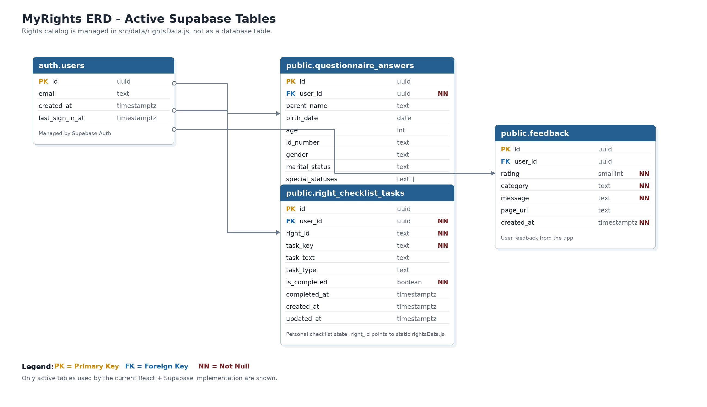

# MyRights - מערכת לאיתור זכויות להורה מבוגר

MyRights היא אפליקציית React שנועדה לסייע לבן או בת משפחה לבדוק בצורה ראשונית אילו זכויות, קצבאות והטבות עשויות להיות רלוונטיות עבור הורה מבוגר.

המערכת אינה קובעת זכאות סופית ואינה מחליפה בדיקה מול גורם רשמי. מטרת המערכת היא לתת הכוונה ראשונית, לרכז מידע חשוב, ולהציג למשתמש רשימת זכויות לבדיקה וצ׳קליסט פעולה אישי.

---

## קישורים

* אתר חי ב-Vercel: https://myrights-frontend.vercel.app
* GitHub Repository: https://github.com/Avirooks/myrights-frontend

---

## מטרת הפרויקט

בישראל קיימות זכויות רבות עבור אזרחים ותיקים, אלמנים ואלמנות, שורדי שואה, נפגעי פעולות איבה, נכי צה״ל ובני משפחותיהם. בפועל, המידע מפוזר בין אתרים וגופים שונים, ולעיתים קשה להבין מה רלוונטי למקרה אישי מסוים.

המטרה של MyRights היא לרכז את התהליך הראשוני במקום אחד:

* מילוי שאלון קצר.
* התאמת זכויות לבדיקה.
* הצגת דשבורד אישי וברור.
* הצגת זכויות עתידיות שקרובות למימוש.
* סימון התקדמות בצ׳קליסט אישי.
* שמירת נתונים והתקדמות לפי משתמש מחובר.
* איסוף משוב משתמשים לצורך שיפור המוצר.

---

## קהל יעד

המערכת מיועדת בעיקר ל:

* בן או בת משפחה שמסייעים להורה מבוגר.
* אדם מבוגר שרוצה לבדוק זכויות בצורה פשוטה.
* משתמשים שאינם מומחים בביטוח לאומי, רשויות מקומיות או אתרי ממשלה.
* מי שרוצה לקבל תמונת מצב ראשונית לפני פנייה לגורם רשמי.

---

## הבעיה שהמערכת פותרת

הבעיה המרכזית היא שהמידע על זכויות קיים, אבל הוא:

* מפוזר בין אתרים שונים.
* מנוסח לעיתים בשפה משפטית או מקצועית.
* לא תמיד מותאם אישית למצב המשתמש.
* דורש מהמשתמש לדעת מראש מה עליו לחפש.
* לא מאפשר מעקב פשוט אחרי מה כבר נבדק ומה עדיין פתוח.

MyRights מציעה תהליך פשוט יותר: המשתמש עונה על שאלון קצר, והמערכת מציגה רשימת זכויות לבדיקה וצ׳קליסט פעולה אישי.

---

## טכנולוגיות בפרויקט

הפרויקט נבנה באמצעות:

* React
* Vite
* React Router
* Supabase
* CSS מותאם אישית
* Git / GitHub
* Vercel

---

## שירותים חיצוניים ואינטגרציות

| שירות             | סוג                  | שימוש בפרויקט                                    |
| ----------------- | -------------------- | ------------------------------------------------ |
| Supabase          | Backend as a Service | Authentication, Database, RLS ושמירת נתוני משתמש |
| Vercel            | Hosting / Deployment | פריסת האתר לסביבת Production                     |
| Vercel Analytics  | Analytics            | מעקב אחרי כניסות וצפיות באתר                     |
| Microsoft Clarity | Behavioral Analytics | הקלטות שימוש, Sessions וניתוח התנהגות משתמשים    |
| Sentry            | Error Monitoring     | ניטור שגיאות JavaScript ותקלות בזמן אמת          |
| GitHub            | Version Control      | ניהול קוד, commits וחיבור ל-Vercel               |
| Google Fonts      | UI / Typography      | שימוש בפונט Assistant                            |

---

## ארכיטקטורה כללית

המערכת בנויה כ-React SPA:

```text
User Browser
    ↓
Vercel
React + Vite Frontend
    ↓
Supabase
Auth + Database + RLS
```

ה-Frontend רץ ב-Vercel.
ה-Backend מנוהל ב-Supabase.
הקוד מנוהל ב-GitHub וכל `git push` מפעיל Deploy אוטומטי ב-Vercel.

---

## מבנה כללי של המערכת

המערכת כוללת את הדפים והרכיבים המרכזיים הבאים:

### מסך התחברות

הכתובת הראשית של האתר מובילה למסך התחברות. משתמש לא מחובר שנכנס לדפים פרטיים מועבר למסך ההתחברות.

דפים פרטיים מוגנים:

* `/questionnaire`
* `/dashboard`
* `/right/:id`

### דף הבית

דף פתיחה שמסביר את מטרת המערכת ומאפשר למשתמש להתחיל בדיקת זכויות.

בדף הבית קיימים גם אזורים שמייצגים הרחבה עתידית:

* חיפוש זכויות.
* עוזר זכויות חכם.
* תמיכה בשפות נוספות.
* מצב מנהל.

### שאלון זכויות

השאלון אוסף פרטים בסיסיים על ההורה:

* שם ההורה.
* תאריך לידה.
* גיל מחושב אוטומטית.
* מספר תעודת זהות, אופציונלי.
* מגדר.
* מצב משפחתי.
* סטטוסים מיוחדים, לדוגמה:

  * נכה צה״ל.
  * בן/בת משפחה של נכה צה״ל.
  * משפחה שכולה.
  * נפגע/ת פעולות איבה.
  * שורד/ת שואה.
  * לא רלוונטי.

לאחר שליחת השאלון הנתונים נשמרים ב-Supabase בטבלת `questionnaire_answers`.

### דשבורד זכויות

לאחר מילוי השאלון המשתמש עובר לדשבורד אישי.

בדשבורד מוצגים:

* תקציר פרטי השאלון.
* זכויות שרלוונטיות לבדיקה עכשיו.
* זכויות שקרובות למימוש בעתיד.
* כרטיסי זכויות עם מידע תמציתי.
* קישור לדף פירוט עבור כל זכות.
* צ׳קליסט מימוש זכויות.

המערכת לא מציגה קביעה סופית של זכאות, אלא משתמשת בניסוח זהיר כמו:

* רלוונטי לבדיקה.
* מומלץ לבדוק.
* זכות לבדיקה ראשונית.

### דף פירוט זכות

בדף זה מוצג מידע נוסף על כל זכות:

* שם הזכות.
* תיאור קצר.
* גורם רשמי רלוונטי.
* סטטוס בדיקה.
* שלבי פעולה כלליים.
* קישור למקור רשמי, כאשר קיים.

### צ׳קליסט מימוש זכויות

הצ׳קליסט מאפשר למשתמש לסמן אילו זכויות כבר נבדקו או טופלו.

הצ׳קליסט כולל:

* זכויות למימוש עכשיו.
* זכויות קרובות למימוש.
* סימון בוצע / לא בוצע.
* שמירה ב-Supabase לפי משתמש מחובר.
* טעינת הסימונים מחדש לאחר רענון, מעבר דפים, יציאה וחזרה לחשבון.

### טופס משוב

במערכת קיים כפתור משוב צף. משתמש מחובר יכול לשלוח:

* דירוג בכוכבים.
* סוג משוב.
* הודעה חופשית.
* כתובת העמוד שממנו נשלח המשוב.

המשוב נשמר בטבלת `feedback` ב-Supabase.

---

## זכויות לדוגמה במערכת

המערכת כוללת זכויות כגון:

* קצבת אזרח ותיק.
* קצבת שאירים.
* גמלת סיעוד.
* השלמת הכנסה.
* הנחה בארנונה.
* בדיקת חסכונות פנסיוניים.
* נסיעה חינם בתחבורה ציבורית מגיל 67.
* הנחה בתחבורה ציבורית לנשים מגיל 62.
* זכויות לשורדי שואה.
* זכויות לנפגעי פעולות איבה.
* זכויות לנכי צה״ל ובני משפחותיהם.
* זכויות למשפחות שכולות.

---

## לוגיקת התאמת הזכויות

המערכת מתאימה זכויות לפי כללי התאמה בסיסיים.

לדוגמה:

* גיל מינימלי.
* גיל מקסימלי.
* מגדר.
* מצב משפחתי.
* סטטוס מיוחד.

אם הזכות עומדת בכללי ההתאמה, היא מוצגת בדשבורד כזכות לבדיקה.

בנוסף, קיימת לוגיקה לזכויות עתידיות. לדוגמה, אם משתמש קרוב לגיל שבו זכות מסוימת עשויה להפוך לרלוונטית, המערכת יכולה להציג אותה כזכות קרובה למימוש.

מאגר הזכויות עצמו מנוהל כיום בקובץ סטטי בצד ה-Frontend:

```text
src/data/rightsData.js
```

החלטה זו נועדה לשמור על מערכת פשוטה, יציבה וברורה במסגרת הפרויקט. לכן מאגר הזכויות אינו מופיע כטבלת Database ב-ERD.

---

## Database ERD

התרשים הבא מציג את טבלאות Supabase הפעילות שבהן מערכת MyRights משתמשת בפועל.

מאגר הזכויות עצמו מנוהל כיום בקובץ סטטי בצד ה-Frontend בשם `src/data/rightsData.js`, ולא כטבלת Database. החלטה זו נועדה לשמור על מערכת פשוטה, יציבה וברורה במסגרת הפרויקט.



---

## טבלאות Supabase פעילות

| טבלה                    | תפקיד                               |
| ----------------------- | ----------------------------------- |
| `auth.users`            | ניהול משתמשים דרך Supabase Auth     |
| `questionnaire_answers` | שמירת תשובות שאלון לפי משתמש        |
| `right_checklist_tasks` | שמירת מצב משימות הצ׳קליסט לפי משתמש |
| `feedback`              | שמירת משוב משתמשים                  |

---

## שמירת מידע

המערכת שומרת מידע ב-Supabase.

המידע הנשמר כולל:

* תשובות השאלון.
* סימוני צ׳קליסט.
* משוב משתמשים.
* שיוך המידע למשתמש המחובר.

השמירה מתבצעת עם Row Level Security כך שכל משתמש יכול לגשת רק למידע שלו.

---

## אבטחה והרשאות

המערכת משתמשת ב-Supabase Authentication לצורך זיהוי משתמשים.

בנוסף קיימות הרשאות RLS בטבלאות, כך שמשתמש מחובר יכול:

* לקרוא את המידע שלו.
* להוסיף מידע שלו.
* לעדכן מידע שלו.
* לשלוח משוב אישי.

בנוסף, הדפים הפרטיים מוגנים בצד ה-Frontend באמצעות `ProtectedRoute`, כך שמשתמש לא מחובר מועבר למסך ההתחברות.

---

## עיצוב וחוויית משתמש

העיצוב נבנה ב-CSS מותאם אישית.

המערכת כוללת:

* ממשק בעברית.
* תמיכה ב-RTL.
* עיצוב מותאם לדסקטופ ולמובייל.
* Navbar קבוע בראש האתר.
* כרטיסי זכויות ברורים.
* כפתורי פעולה בולטים.
* דשבורד נוח לקריאה.
* צ׳קליסט מותאם למובייל ולדסקטופ.
* כפתור משוב צף.
* Modal משוב מותאם למסכים קטנים.

קבצי ה-CSS הפעילים בפרויקט:

```text
src/styles/globals.css
src/styles/navbar.css
```

---

## נגישות

במערכת קיימות אפשרויות נגישות בסיסיות:

* מצב ניגודיות גבוהה.
* מצב גווני אפור.
* הדגשת קישורים.
* איפוס הגדרות נגישות.
* הגדלת והקטנת טקסט.

מגבלה ידועה: הגדלת והקטנת טקסט אינן משפיעות עדיין בצורה מלאה על כל רכיבי האתר, מכיוון שחלק מהרכיבים משתמשים בגדלי פונט מוגדרים ישירות. זה מוגדר כשיפור עתידי.

---

## Monitoring and Feedback

לצורך בדיקות ושיפור המוצר לאחר ה-Deploy, חוברו מספר כלי ניטור ומשוב:

### Vercel Analytics

משמש למעקב אחרי כניסות וצפיות באתר.

### Microsoft Clarity

משמש לצפייה ב-Sessions, הקלטות שימוש וניתוח התנהגות משתמשים באתר.

### Sentry

משמש לניטור שגיאות JavaScript ותקלות בזמן אמת.

### Internal Feedback Form

טופס משוב פנימי שנשמר ב-Supabase בטבלת `feedback`.

---

## פיצ׳רים פעילים

בשלב הנוכחי קיימים במערכת:

* מסך התחברות והרשמה.
* דף בית.
* הגנה על דפים פרטיים.
* שאלון זכויות.
* שמירת תשובות שאלון ב-Supabase.
* דשבורד זכויות אישי.
* התאמת זכויות לפי כללים בסיסיים.
* דף פירוט לכל זכות.
* צ׳קליסט מימוש זכויות.
* שמירת סימוני צ׳קליסט ב-Supabase.
* טופס משוב פנימי.
* שמירת משוב ב-Supabase.
* תמיכה בדסקטופ ובמובייל.
* תפריט ניווט.
* אפשרויות נגישות בסיסיות.
* ניטור שימוש ושגיאות באמצעות Vercel Analytics, Clarity ו-Sentry.

---

## פיצ׳רים בפיתוח

במערכת קיימים אזורים שמייצגים הרחבה עתידית של המוצר:

* חיפוש זכויות, הטבות וקצבאות.
* עוזר זכויות חכם לשאלות חופשיות.
* תמיכה בשפות נוספות.
* מצב מנהל לניהול תוכן וזכויות.
* שיפור מלא של הגדלת והקטנת טקסט.
* שמירת העדפות נגישות לפי משתמש.
* הוספת מסמכים נדרשים לכל זכות.
* התראות עתידיות לזכויות שמתקרבות למימוש.
* הרחבת מאגר הזכויות.
* העברת מאגר הזכויות מ-`rightsData.js` לטבלת Database בעתיד.
* חיבור מלא יותר למקורות רשמיים.

---

## מגבלות ידועות

המערכת היא מערכת בדיקה ראשונית בלבד.

לכן:

* היא אינה קובעת זכאות סופית.
* היא אינה מחליפה בדיקה מול ביטוח לאומי, רשות מקומית או גוף רשמי אחר.
* חלק מהזכויות דורשות תנאים נוספים שלא נבדקים בשאלון הנוכחי.
* חלק מהפיצ׳רים בדף הבית מסומנים כפיתוח עתידי.
* עוזר הזכויות החכם הוא רכיב Demo בשלב זה ואינו מחובר לשירות AI חיצוני.
* נגישות הטקסט עדיין דורשת שיפור נוסף.

---

## התקנה והרצה מקומית

```bash
npm install
npm run dev
```

---

## Build

```bash
npm run build
```

---

## משתני סביבה

הפרויקט משתמש ב-Supabase ולכן נדרש קובץ `.env`.

דוגמה למבנה הקובץ:

```env
VITE_SUPABASE_URL=your_supabase_url
VITE_SUPABASE_ANON_KEY=your_supabase_anon_key
```

אין להעלות את קובץ `.env` ל-GitHub.

---

## מבנה תיקיות עיקרי

```text
src/
  components/
    Button.jsx
    Card.jsx
    FeedbackButton.jsx
    FeedbackForm.jsx
    Navbar.jsx
    ProtectedRoute.jsx
    RightsChecklist.jsx
    StatusBadge.jsx

  context/
    AuthContext.jsx

  data/
    rightsData.js

  lib/
    supabase.js

  pages/
    HomePage.jsx
    QuestionnairePage.jsx
    DashboardPage.jsx
    RightDetailsPage.jsx
    LoginPage.jsx
    RegisterPage.jsx

  styles/
    globals.css
    navbar.css

  App.jsx
  main.jsx
```

---

## תרחישי בדיקה שבוצעו

### בדיקת Login וניתוב

* כניסה לכתובת הראשית מובילה למסך Login.
* `/login` עובד ללא 404.
* משתמש לא מחובר שנכנס ל-`/dashboard` מועבר ל-Login.
* משתמש מחובר יכול להיכנס ל-`/dashboard`.
* רענון בדפים פנימיים עובד ב-Production באמצעות `vercel.json`.

### בדיקת דף הבית

* תצוגת דסקטופ תקינה.
* תצוגת מובייל תקינה.
* כפתור התחלת בדיקה מוביל לפי מצב המשתמש.
* אזורים בפיתוח מסומנים כראוי.

### בדיקת שאלון

* מילוי שאלון חדש.
* חישוב גיל לפי תאריך לידה.
* שמירת נתונים ב-Supabase.
* עריכת שאלון קיים.
* חזרה לדשבורד לאחר עדכון.

### בדיקת דשבורד

* הצגת זכויות לפי נתוני השאלון.
* הצגת זכויות עתידיות רלוונטיות.
* מעבר לדף פירוט זכות.
* חזרה לדשבורד.
* התאמה למובייל.

### בדיקת צ׳קליסט

* סימון משימה כבוצעה.
* שמירה ב-Supabase.
* רענון הדף.
* מעבר דפים וחזרה לדשבורד.
* בדיקה שהסימון נשמר.

### בדיקת משוב

* פתיחת Modal משוב.
* דירוג בכוכבים.
* בחירת סוג משוב.
* שליחת הודעה.
* שמירה בטבלת `feedback` ב-Supabase.
* חסימת שליחה למשתמש לא מחובר.

### בדיקת Monitoring

* Vercel Analytics מציג נתוני שימוש.
* Microsoft Clarity מציג Recordings.
* Sentry קולט שגיאות JavaScript.

---

## דוגמאות לתרחישי משתמש

### תרחיש 1: הורה בן 65, אלמן

המערכת עשויה להציג:

* קצבת שאירים כזכות לבדיקה עכשיו.
* קצבת אזרח ותיק כזכות עתידית.
* נסיעה חינם בתחבורה ציבורית מגיל 67 כזכות עתידית.

### תרחיש 2: הורה מעל גיל 67

המערכת עשויה להציג:

* קצבת אזרח ותיק.
* נסיעה חינם בתחבורה ציבורית.
* הנחה בארנונה.
* בדיקת חסכונות פנסיוניים.
* זכויות נוספות לפי מצב משפחתי וסטטוסים מיוחדים.

### תרחיש 3: שורד/ת שואה

אם המשתמש מסמן סטטוס של שורד/ת שואה, המערכת מציגה זכות רלוונטית לבדיקה עבור אוכלוסייה זו.

---

## Future Improvements

שיפורים אפשריים להמשך:

* חיבור עוזר הזכויות לשירות AI אמיתי.
* העברת מאגר הזכויות לטבלת Database.
* הוספת מסך ניהול למנהל מערכת.
* הרחבת שאלון הזכויות.
* הוספת קבצי מסמכים נדרשים לכל זכות.
* שיפור מלא של נגישות הטקסט.
* תמיכה מלאה בשפות נוספות.
* הוספת התראות לזכויות שמתקרבות למימוש.
* הפקת דוחות שימוש ומשוב.
* חיבור Google OAuth להרשמה מהירה.

---

## הערת אחריות

MyRights אינה מערכת רשמית ואינה קובעת זכאות משפטית או כספית.
המידע במערכת מיועד להכוונה ראשונית בלבד.
לפני קבלת החלטות או הגשת בקשות יש לבדוק את המידע מול הגורמים הרשמיים הרלוונטיים.
